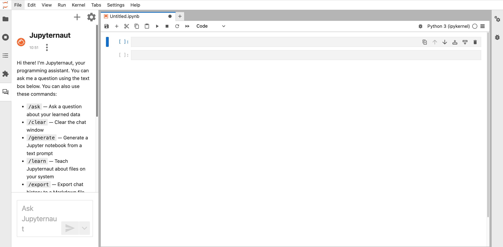
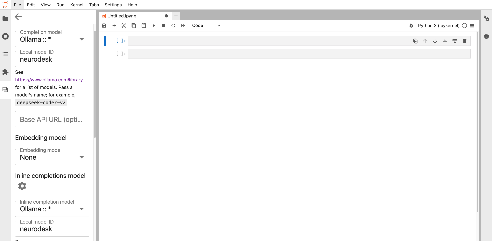

# jupyter-ai-neurodesk

## Neurodesk Copilot 

How to enable the Neurodesk Copilot in Jupyter AI  (

### Step 1: Install Jupyter AI and Jupyter lab

```bash
conda create -n jupyter-ai python=3.12
conda activate jupyter-ai
pip install jupyterlab gitpython
pip install 'jupyter-ai[all]'
```

### Deploying Neurodesk Copilot model with ollama for linux
```bash
curl -fsSL https://ollama.com/install.sh | sh
git clone https://github.com/jnikhilreddy/jupyter-ai-neurodesk.git
cd jupyter-ai-neurodesk/
wget https://huggingface.co/jnikhilreddy/neurodesk-gguf/resolve/main/neurodesk.gguf?download=true -O neurodesk.gguf
ollama create  neurodesk -f ./Modelfile  
#Optional: To make Neurodesk copilot faster (quantize the Neurodesk model): ollama create --quantize q4_K_M neurodesk -f ./Modelfile 
ollama run neurodesk
```


Start Jupyter lab with Neurodesk Copilot
```bash
jupyter lab 
```

### Choose Neurodesk copilot in Jupyter AI: Press on settings and choose Ollama and neurodesk model and save settings



Feel free to update the settings to disable auto completer to manual invocation in Settings -> Settings Editor -> Inline Completer

